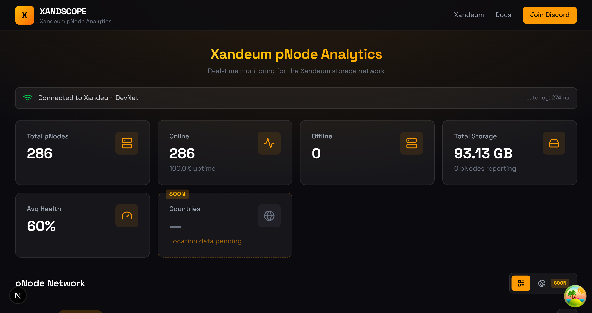
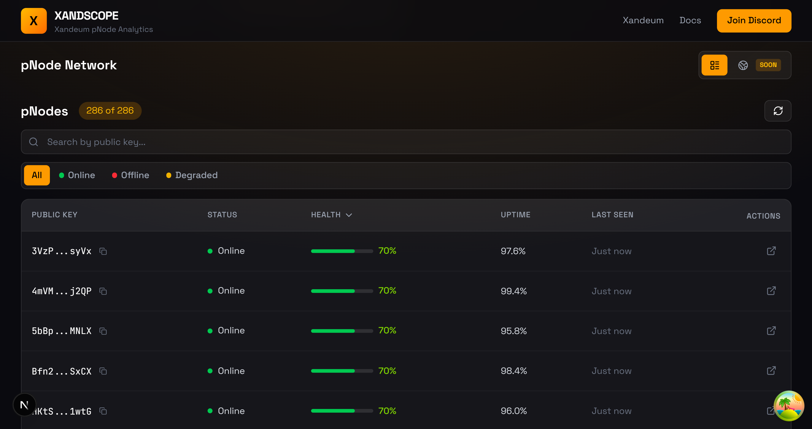
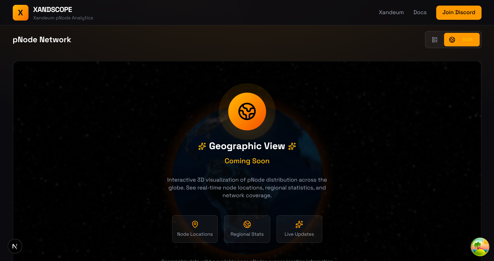

# 🔭 XANDSCOPE

> The Ultimate Xandeum pNode Analytics Platform

[](https://nextjs.org/)
[](https://www.typescriptlang.org/)
[](https://tailwindcss.com/)
[](LICENSE)

## Overview

XANDSCOPE is a real-time analytics dashboard for the Xandeum pNode network. It provides comprehensive visibility into network health, storage capacity, and individual pNode performance.

## 📸 Screenshots

### Network Overview


### pNode Statistics


### Global 


## ✨ Features

### Dashboard
- **Network Statistics** - Total pNodes, online count, storage capacity
- **pNode Table** - Searchable, sortable list of all registered pNodes
- **Health Scoring** - Tiered health classification (Excellent → Critical)
- **3D Globe** - Geographic distribution visualization (Coming Soon)
- **Real-time Updates** - Auto-refresh with background polling

### Stats Aggregation System
- **Opt-in Reporting** - pNode operators can choose to share stats
- **Privacy-First** - IP/hostname hashed, never stored raw
- **Central Backend** - Aggregates data from participating pNodes

## 🏗️ Architecture

```
┌─────────────────────────────────────────────────────────────────┐
│                        XANDSCOPE                                 │
├─────────────────────────────────────────────────────────────────┤
│                                                                 │
│   ┌──────────────────┐      ┌──────────────────┐               │
│   │   Dashboard      │      │  Stats Service   │               │
│   │   (Next.js)      │◄────►│  (Express)       │               │
│   │   :3000          │      │  :3001           │               │
│   └────────┬─────────┘      └────────┬─────────┘               │
│            │                         │                          │
│            │                         │                          │
│            ▼                         ▼                          │
│   ┌──────────────────┐      ┌──────────────────┐               │
│   │  Xandeum DevNet  │      │   PostgreSQL     │               │
│   │  (On-chain data) │      │   (Stats data)   │               │
│   └──────────────────┘      └──────────────────┘               │
│                                      ▲                          │
│                                      │                          │
│   ┌──────────────────────────────────┼─────────────────────┐   │
│   │              pNodes (with stats patch)                  │   │
│   │   ┌─────────┐  ┌─────────┐  ┌─────────┐  ┌─────────┐   │   │
│   │   │ pNode 1 │  │ pNode 2 │  │ pNode 3 │  │ pNode N │   │   │
│   │   └─────────┘  └─────────┘  └─────────┘  └─────────┘   │   │
│   └─────────────────────────────────────────────────────────┘   │
│                                                                 │
└─────────────────────────────────────────────────────────────────┘
```

## 🚀 Quick Start

### Prerequisites

- Node.js >= 18.x
- Yarn or pnpm
- PostgreSQL 14+ (for stats service)

### Installation

```bash
# Clone the repository
git clone https://github.com/BZetsu/Xandeum-pNode-public.git
cd Xandeum-pNode-public

# Install dependencies
yarn install

# Set up environment variables
cp .env.example .env.local
# Edit .env.local with your configuration

# Run the dashboard
yarn dev
```

Open [http://localhost:3000](http://localhost:3000) to view the dashboard.

### Running the Stats Service

```bash
cd packages/stats-service

# Install dependencies
yarn install

# Set up database
cp .env.example .env
# Edit .env with your PostgreSQL connection string

# Run the service
yarn dev
```

## 📁 Project Structure

```
xandeum-pnode-analytics/
├── src/
│   ├── app/                    # Next.js App Router
│   ├── components/             # React components
│   │   ├── dashboard/          # Dashboard components
│   │   └── pnode/              # pNode-specific components
│   ├── hooks/                  # React Query hooks
│   ├── services/               # API services
│   ├── types/                  # TypeScript types
│   └── config/                 # Configuration
├── packages/
│   └── stats-service/          # Stats aggregation backend
│       └── src/
│           ├── db/             # Database layer + schema.sql
│           ├── routes/         # API routes
│           ├── middleware/     # Auth, rate limiting
│           └── types/          # TypeScript interfaces
└── public/                     # Static assets + screenshots
```

## 🔧 Configuration

### Environment Variables

#### Dashboard (.env.local)

| Variable | Default | Description |
|----------|---------|-------------|
| `NEXT_PUBLIC_STATS_SERVICE_URL` | `https://stats.xandscope.io` | Stats service URL |

#### Stats Service (.env)

| Variable | Default | Description |
|----------|---------|-------------|
| `PORT` | `3001` | Server port |
| `DATABASE_URL` | - | PostgreSQL connection string |
| `CORS_ORIGIN` | `http://localhost:3000` | Allowed origins |
| `REQUIRE_SIGNATURE` | `false` | Require Ed25519 signatures |

## 📡 API Reference

### Dashboard → Xandeum DevNet

Uses `@solana/web3.js` to query on-chain pNode data:

```typescript
// Fetch all pNodes from index account
const pnodes = await connection.getParsedAccountInfo(PNODE_INDEX);
```

### Stats Service API

| Endpoint | Method | Description |
|----------|--------|-------------|
| `POST /api/report` | POST | Submit pNode stats |
| `GET /api/network/stats` | GET | Get aggregated network stats |
| `GET /api/pnodes` | GET | List all reporting pNodes |
| `GET /api/pnode/:publicKey` | GET | Get specific pNode stats |
| `GET /api/health` | GET | Health check |

## 🔒 Privacy

XANDSCOPE is privacy-first:

- ✅ **Opt-in only** - Stats reporting disabled by default
- ✅ **Hashed identifiers** - IP and hostname are SHA-256 hashed (16 chars)
- ✅ **No tracking** - No cookies, no analytics, no user tracking
- ❌ **Never stores** - Raw IP addresses or hostnames

## 🧪 Development

### Running Tests

```bash
# Run all tests
yarn test

# Run with coverage
yarn test:coverage
```

### Type Checking

```bash
yarn typecheck
```

### Linting

```bash
yarn lint
```

## 📚 Documentation

- [Stats Service README](packages/stats-service/README.md) - Backend API documentation
- [Database Schema](packages/stats-service/src/db/schema.sql) - PostgreSQL schema

## 🤝 Contributing

1. Fork the repository
2. Create your feature branch (`git checkout -b feature/amazing-feature`)
3. Commit your changes (`git commit -m 'Add amazing feature'`)
4. Push to the branch (`git push origin feature/amazing-feature`)
5. Open a Pull Request

## 📜 License

MIT License - See [LICENSE](LICENSE) for details.

## 🔗 Links

- [Xandeum Network](https://xandeum.network)
- [Xandeum Docs](https://docs.xandeum.network)
- [Xandeum GitHub](https://github.com/Xandeum)

---
